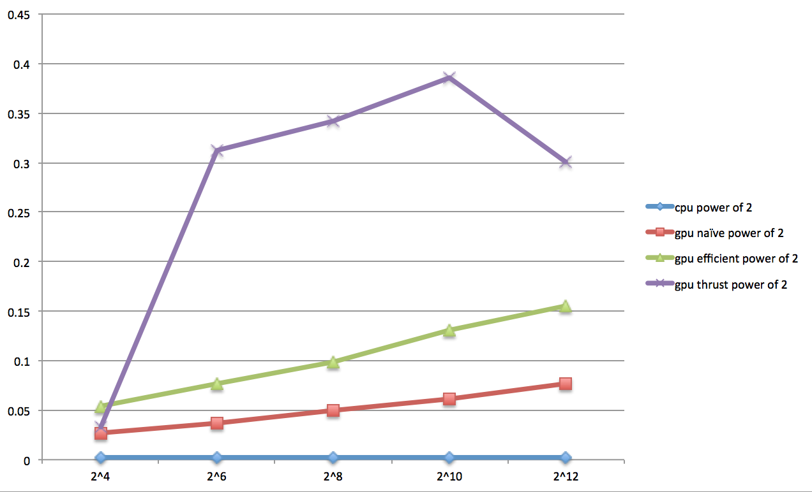
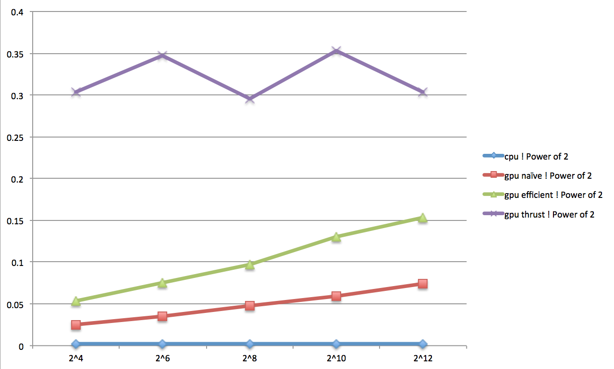

CUDA Stream Compaction
======================

**University of Pennsylvania, CIS 565: GPU Programming and Architecture, Project 2**

* Ziwei Zong
* Tested on: Windows 10, i7-5500 @ 2.40GHz 8GB, GTX 950M (Personal)

Descriptions
--------------------------
-Part 1 : CPU Scan & Compaction (see file cpu.cu)
-Part 2 : Naive Scan (naive.cu)
-Part 3 : Work-Efficient Scan & Compaction (efficient.cu)
-Part 4 : Thrust Scan (thrust.cu)
-Part 5 : Radix Sort (in file thrust.cu, RadixSort::sort)

Block Sizes Optimization
--------------------------
|            |  32 |  64 | 128 | 256 | 512 | 1024|
|------------|-----|-----|-----|-----|-----|-----|
| block_naive|0.062|0.061|0.060|0.062|0.064|0.078|
|   block_eff|0.139|0.139|0.140|0.142|0.148|0.155|
|block_thrust|1.060|1.180|1.200|1.100|1.029|1.090| 
(ms)
Thus, I choose block size 128 for naive scan, 64 for efficient scan and 512 for thrust scan.

CPU & GPU Performance Comparison
--------------------------------
|Array_length|		2^4|	2^6|	2^8|	2^10|	2^12|
|------------|---------|-------|-------|--------|-------|
|cpu			|power of 2		|0.0024	|0.002304	|0.002304	|0.002304	|0.002304|
|cpu			|! Power of 2	|0.0023	|0.002304	|0.002304	|0.002336	|0.002336|
|gpu naïve		|power of 2		|0.027	|0.0374		|0.0496		|	0.0609	|0.0766|
|gpu naïve		|! Power of 2	|0.0252	|0.0355		|0.0473		|0.0587		|0.0745|
|gpu efficient	|power of 2		|0.0541	|0.0765		|0.0985		|0.1312		|0.1551|
|gpu efficient	|! Power of 2	|0.053	|0.0748		|0.0969		|0.1307		|0.1537|
|gpu thrust		|power of 2		|0.03293|0.3129		|0.3414		|	0.3854	|0.3011|
|gpu thrust		|! Power of 2	|0.3039	|0.3476		|0.2955		|	0.3535	|	0.3035|
(ms)
Graph is shown below.

- As the line chart shows, the calculation time for thrust scan doesn't have any specific rules while naive and efficient scan time perform power function correlation with the length of array.
- Weirdly, the time for CPU is very small no matter how long the array is. I was assumming that it was not right to count CPU time using Cuda event so I then tried to use std::clock. However, the result time is even smaller(0.0). Therefore, CPU did perform better than GPU for this task, and that might due to the high cost for memory accessing.
- The naive scan method also performs better than the efficient scan which is not as expected. 

Output 
--------------------------

****************
** SCAN TESTS **
****************

    [  38  19  38  37   5  47  15  35   0  12   3   0  42 ...  26   0 ]
	==== cpu scan, power-of-two ====
	StreamCompaction::CPU::scan : exclusive prefix sum.
	[   0  38  57  95 132 137 184 199 234 234 246 249 249 ... 6203 6229 ]
	==== cpu scan, non-power-of-two ====
	StreamCompaction::CPU::scan : exclusive prefix sum.
    [   0  38  57  95 132 137 184 199 234 234 246 249 249 ... 6146 6190 ]
    passed
	==== naive scan, power-of-two ====
         GPU time for naive scan : 0.0696ms
    [   0  38  57  95 132 137 184 199 234 234 246 249 249 ... 6203 6229 ]
    passed
	==== naive scan, non-power-of-two ====
         GPU time for naive scan : 0.0676ms
    [   0  38  57  95 132 137 184 199 234 234 246 249 249 ... 6146 6190 ]
    passed
	==== work-efficient scan, power-of-two ====
    [  38  19  38  37   5  47  15  35   0  12   3   0  42 ...  26   0 ]
         GPU time for efficient scan : 0.1403ms
    [   0  38  57  95 132 137 184 199 234 234 246 249 249 ... 6203 6229 ]
    passed
	==== work-efficient scan, non-power-of-two ====
    [  38  19  38  37   5  47  15  35   0  12   3   0  42 ...  44   8 ]
         GPU time for efficient scan : 0.1403ms
    [   0  38  57  95 132 137 184 199 234 234 246 249 249 ... 6146 6190 ]
    passed
	==== thrust scan, power-of-two ====
         GPU time for thrust scan : 128.8397ms
    [   0  38  57  95 132 137 184 199 234 234 246 249 249 ... 6203 6229 ]
    passed
	==== thrust scan, non-power-of-two ====
         GPU time for thrust scan : 1.1305ms
    [   0  38  57  95 132 137 184 199 234 234 246 249 249 ... 6146 6190 ]
    passed

*****************************
** STREAM COMPACTION TESTS **
*****************************
    [   2   3   2   1   3   1   1   1   2   0   1   0   2 ...   0   0 ]
	==== cpu compact without scan, power-of-two ====
    [   2   3   2   1   3   1   1   1   2   1   2   1   1 ...   2   1 ]
    passed
	==== cpu compact without scan, non-power-of-two ====
    [   2   3   2   1   3   1   1   1   2   1   2   1   1 ...   3   2 ]
    passed
	==== cpu compact with scan ====
	StreamCompaction::CPU::scan : exclusive prefix sum.
    [   2   3   2   1   3   1   1   1   2   1   2   1   1 ...   2   1 ]
    passed
	==== work-efficient compact, power-of-two ====
    [   2   3   2   1   3   1   1   1   2   0   1   0   2 ...   0   0 ]
    [   2   3   2   1   3   1   1   1   2   1   2   1   1 ...   2   1 ]
    passed
	==== work-efficient compact, non-power-of-two ====
    [   2   3   2   1   3   1   1   1   2   0   1   0   2 ...   0   0 ]
    [   2   3   2   1   3   1   1   1   2   1   2   1   1 ...   3   2 ]
    passed

*****************************
**        Radix Sort       **
*****************************
	==== Radix Sort, power-of-two ====
    [   4   7   2   6   3   5   1   0 ]
    [   4   2   6   0   7   3   5   1 ]
